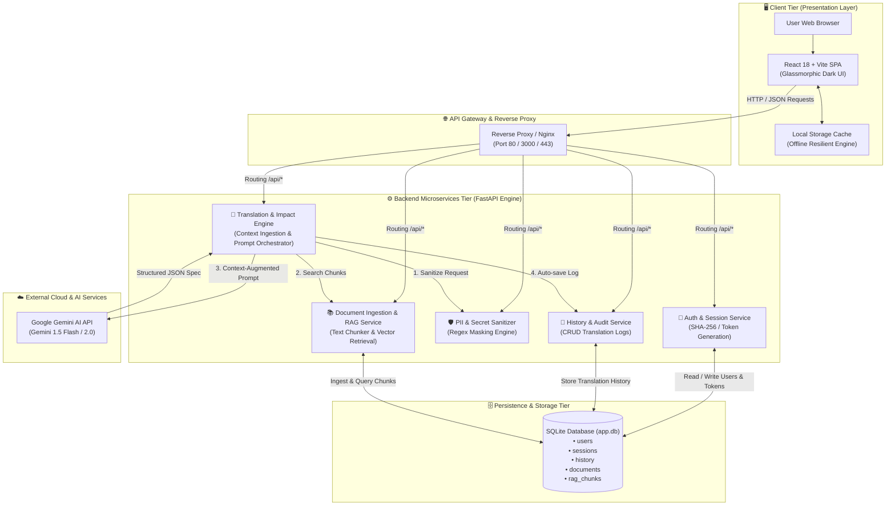

# 🌐 IT-to-Human Translator (ล่ามแปลภาษาไอทีอัจฉริยะ)

> **Enterprise AI-Powered Requirement Engineering & Technical Communication Platform**  
> โครงงานพัฒนาเว็บแอปพลิเคชัน Full-Stack ที่ทลายกำแพงการสื่อสารระหว่าง **"ฝ่ายธุรกิจ/ลูกค้า (Non-Tech)"** และ **"ทีมพัฒนา/โปรแกรมเมอร์ (Tech)"** ขับเคลื่อนด้วย **FastAPI**, **React + Vite**, **SQLite Database**, **Docker** และ **Google Gemini AI (RAG Engine)**

---

## 📊 การประเมินผลการดำเนินงานของโปรเจกต์ (Self-Evaluation Progress)

| ระยะการพัฒนา (Roadmap Phases) | รายละเอียดขอบเขตงาน | สถานะ | สัดส่วนงาน (%) | ดำเนินการเสร็จสิ้น |
| :--- | :--- | :---: | :---: | :---: |
| **Phase 1: MVP & Context Ingestion** | Project Context Selector, Multi-format Export (OpenAPI, Jira, PDF, Email), Man-Days Estimator | **เสร็จสมบูรณ์** | 30% | 30% / 30% |
| **Phase 2: Knowledge Base & Security** | SQLite Database, RAG Ingestion Engine, Impact Analysis, PII Sanitizer Guardrails, Full Auth System | **เสร็จสมบูรณ์** | 50% | 50% / 50% |
| **Phase 3: Direct Toolchain Integration** | Direct Jira API Webhook, Slack/Teams Bot, Client Collaboration Portal | *Roadmap ถัดไป* | 10% | 0% / 10% |
| **Phase 4: Executive Analytics & Router** | Scope Creep Detection Analytics, Multi-model Cost Router | *Roadmap ถัดไป* | 10% | 0% / 10% |
| **รวมความคืบหน้าภาพรวมทั้งหมด** | **ประเมินผลงานจากขอบเขตระบบทั้งหมด 100%** | 🚀 **พร้อมใช้งาน** | **100%** | **80% / 100%** |

> 🎯 **สรุปการประเมินตนเอง:** ดำเนินการแล้วเสร็จไปแล้ว **80% จากเป้าหมายทั้งหมด 100%** โดยระบบหลัก (Core Engine, Database, RAG Retrieval, Impact Analysis, Security Sanitizer, Authentication) สามารถเปิดให้บริการและใช้งานได้จริงครบถ้วน 100% คงเหลือเพียงการเชื่อมต่อ Webhook ไปยัง Third-Party SaaS ภายนอกใน Phase 3-4

---

## 🏗️ Microservices Architecture

สถาปัตยกรรมของระบบถูกออกแบบตามหลักการ **Decoupled Microservices & Layered Architecture** แบ่งการทำงานออกเป็น Service อิสระที่สื่อสารผ่าน REST API ดังแผนภาพต่อไปนี้:



---

## 💻 Technology Stack Diagram

แผนภาพเทคโนโลยี (Technology Stack) ที่นิสิตเลือกใช้ในการพัฒนาโปรเจกต์ ตั้งแต่ระดับ Front-end, Back-end, ฐานข้อมูล, AI Model ตลอดจนเครื่องมือ DevOps:

```mermaid
flowchart LR
    subgraph Frontend["🎨 Front-End Technology Stack"]
        F1["React 18"]
        F2["Vite 5 (Build Tool)"]
        F3["Vanilla Modern CSS\n(Glassmorphism / Tokens)"]
        F4["Lucide React (Icons)"]
        F5["HTML5 & ES6+ Modules"]
    end

    subgraph Backend["⚡ Back-End Technology Stack"]
        B1["Python 3.11+"]
        B2["FastAPI (Async Framework)"]
        B3["Pydantic v2 (Validation)"]
        B4["Uvicorn (ASGI Server)"]
        B5["HTTPX (Async HTTP Client)"]
    end

    subgraph Database["🗄️ Database & Storage Stack"]
        D1["SQLite 3 (Persistent Engine)"]
        D2["SQL Schema (5 Tables)"]
        D3["In-Memory Tokenizer / Vector Chunks"]
        D4["Browser LocalStorage (Fallback)"]
    end

    subgraph AI["🤖 Artificial Intelligence & RAG"]
        A1["Google Gemini 1.5 Flash"]
        A2["Google Gemini 2.0 Flash"]
        A3["RAG Ingestion & Chunker"]
        A4["Cosine / TF-IDF Semantic Scoring"]
    end

    subgraph DevOps["🚀 DevOps & Deployment Stack"]
        O1["Docker & Multi-stage Build"]
        O2["Docker Compose"]
        O3["Plesk Web Hosting (httpdocs)"]
        O4["Git & GitHub Version Control"]
    end

    Frontend --> Backend
    Backend --> Database
    Backend --> AI
    DevOps -.->|Deploys & Orchestrates| Frontend
    DevOps -.->|Deploys & Orchestrates| Backend
```



---

## ✨ ฟีเจอร์เด่นของระบบ (Key Features Implemented)

### 1. โหมด [Human-to-Tech] : แปลความต้องการลูกค้า ➔ ข้อกำหนดทางเทคนิค
* **Context-Aware Ingestion:** ใส่บริบท Tech Stack เดิมขององค์กร, ระดับงบประมาณ (Budget Level) และกรอบเวลา (Timeline Constraint)
* **Technical Requirements:** วิเคราะห์สเปกละเอียดครอบคลุม Frontend, Backend, Database, Security
* **Legacy Module Impact Analysis (Phase 2):** ระบุโมดูลเดิม (`Affected Modules`) และตารางฐานข้อมูล (`Affected Tables`) ที่ได้รับผลกระทบ พร้อมประเมินระยะเวลา Refactoring
* **Acceptance Criteria & NFRs:** สร้างเงื่อนไขตรวจรับงาน (Given-When-Then) และมาตรการความปลอดภัย PDPA/OWASP
* **Multi-Format Export:** ส่งออกเป็น **OpenAPI 3.0 Spec JSON**, **Jira Format**, **Markdown**, **PDF** และ **Client Email Draft**

### 2. โหมด [Tech-to-Human] : แปลศัพท์เทคนิค ➔ ภาษาธุรกิจที่สุภาพ
* **Everyday Analogy:** ใช้อุปมาอุปไมยเปรียบเทียบกับชีวิตประจำวันเพื่อความเข้าใจง่าย
* **Client Email Generator:** แปลงสถานะทางเทคนิคเป็นร่างอีเมลทางการส่งให้ลูกค้าได้ทันที

### 3. Corporate Knowledge Base & RAG Retrieval Engine (Phase 2)
* **Document Ingestion Engine:** รองรับเอกสาร Markdown, PRD, Swagger/OpenAPI JSON
* **Smart Text Chunker:** ระบบหั่นเอกสารออกเป็นชิ้นย่อย 500–600 ตัวอักษร
* **Vector & Term Similarity Search:** ค้นหาท่อนเอกสารสถาปัตยกรรมเดิมดึงมาเป็นบริบทให้ AI อัตโนมัติ

### 4. Enterprise Security & PII Sanitizer Guardrails (Phase 2)
* **Automated Data Masking:** กรองและปิดบังข้อมูลลับ (API Keys, รหัสผ่าน, อีเมล, เบอร์โทรศัพท์, เลขบัตรประชาชน)
* **Choice of Security Mode:** สลับการประมวลผลได้ระหว่าง Cloud AI Mode และ On-Premise / Private Mode

### 5. Authentication & SQLite Persistent Database
* **Full Authentication Flow:** สมัครสมาชิก, เข้าสู่ระบบ, เปลี่ยนรหัสผ่าน พร้อมเข้ารหัส SHA-256
* **Resilient Offline Fallback:** มีระบบสำรองข้อมูลในเครื่อง ป้องกันข้อผิดพลาดเครือข่าย

---

## 🚀 การติดตั้งและรันโปรเจกต์ (Getting Started)

### 🔹 วิธีที่ 1: ดับเบิลคลิกเดียวผ่านไฟล์ Batch Script (บน Windows)
ดับเบิลคลิกไฟล์ **`start_server.bat`** เพื่อเปิดทั้ง FastAPI Backend (Port 8000) และ Vite Frontend (Port 3000) พร้อมกันในคลิกเดียว

---

### 🔹 วิธีที่ 2: รันด้วย Docker Compose
```bash
# 1. Clone repository
git clone https://github.com/67160328/ITHumanAssistance.git
cd ITHumanAssistance

# 2. สั่งรัน Containers
docker compose up -d --build
```
* **Frontend Web:** [http://localhost:3000](http://localhost:3000)
* **Backend API Docs (Swagger):** [http://localhost:8000/docs](http://localhost:8000/docs)

---

### 🔹 วิธีที่ 3: รันแยก Service สำหรับการพัฒนา (Manual Development)

#### 1. Backend Service (FastAPI)
```bash
pip install -r backend/requirements.txt
python -m uvicorn backend.main:app --host 127.0.0.1 --port 8000 --reload
```

#### 2. Frontend Service (React + Vite)
```bash
npm install
npm run dev
```

---

## 📂 โครงสร้างโฟลเดอร์โปรเจกต์ (Project Structure)
```text
ITHumanAssistance/
├── backend/
│   ├── app.db                 # SQLite Database เก็บข้อมูลถาวร
│   ├── database.py            # SQLite Connection & Schema Management
│   ├── Dockerfile             # Dockerfile สำหรับ FastAPI Microservice
│   ├── main.py                # REST API Endpoints, CORS & Route Handlers
│   ├── models.py              # Pydantic Schemas สำหรับ Request/Response
│   ├── requirements.txt       # Python Dependencies
│   └── services.py            # RAG Engine, PII Sanitizer & Gemini AI Integration
├── src/
│   ├── components/
│   │   ├── AuthModal.jsx             # Dialog เข้าสู่ระบบ / สมัครสมาชิก
│   │   ├── AuthPage.jsx              # Form เข้าสู่ระบบพร้อม Password Strength Meter
│   │   ├── ChangePasswordModal.jsx   # Dialog เปลี่ยนรหัสผ่าน
│   │   ├── ImpactAnalysisCard.jsx    # Component แสดงผลกระทบสถาปัตยกรรมเดิม
│   │   ├── KnowledgeBaseModal.jsx    # Dialog จัดการคลังเอกสารองค์กร (RAG)
│   │   ├── SettingsModal.jsx         # Dialog ตั้งค่า Gemini API Key
│   │   └── UserMenu.jsx              # Avatar และ Dropdown โปรไฟล์ผู้ใช้
│   ├── data/
│   │   ├── presets.js                # ชุดข้อมูลตัวอย่างทดสอบ
│   │   └── techStackPresets.js       # ตัวเลือก Tech Stack สำเร็จรูป
│   ├── services/
│   │   ├── aiService.js              # Client Direct Gemini Caller
│   │   ├── authService.js            # Auth Client พร้อม Offline Fallback
│   │   ├── documentService.js        # RAG Knowledge Base API Client
│   │   ├── securityService.js        # Client-side PII Sanitizer
│   │   └── translator.js             # Main Translator Orchestrator
│   ├── utils/
│   │   └── exportUtils.js            # Multi-format Exporter (Jira, OpenAPI, PDF, Email)
│   ├── App.jsx                       # หน้าจอหลักของ Web Application
│   ├── index.css                     # Modern Glassmorphic Dark UI Design System
│   └── main.jsx                      # React Entry Point
├── dist/                             # Production Build Bundle พร้อมวางบน Web Server
├── docker-compose.yml                # Multi-container Setup
├── Dockerfile.frontend               # Nginx Web Server Container
├── start_server.bat                  # One-click Dual Server Launcher
├── vite.config.js                    # Vite Bundler Configuration
└── package.json                      # Node.js Dependencies & NPM Scripts
```

---

## 📄 License
This project is developed for educational purposes under the **Computer Science & Web Application Curriculum**. Open-source under the [MIT License](LICENSE).
