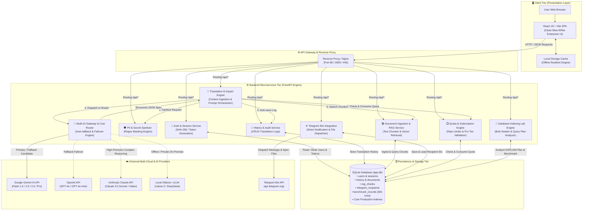

# 🌐 IT-to-Human Translator (ล่ามแปลภาษาไอทีอัจฉริยะ)

> **Enterprise AI-Powered Requirement Engineering & Technical Communication Platform**  
> โครงงานพัฒนาเว็บแอปพลิเคชัน Full-Stack ที่ทลายกำแพงการสื่อสารระหว่าง **"ฝ่ายธุรกิจ/ลูกค้า (Non-Tech)"** และ **"ทีมพัฒนา/โปรแกรมเมอร์ (Tech)"** ขับเคลื่อนด้วย **FastAPI (Python 3.11+)**, **React 18 + Vite**, **SQLite Database (Persistent & Indexed)**, **Telegram Bot Webhook**, **Database Indexing Optimization Studio**, **Multi-AI Provider Gateway (Gemini, OpenAI, Claude, Local LLM)**, **Clean Enterprise Blue-White Design System** และ **Docker Containerization**

---

## 📊 การประเมินผลการดำเนินงานของโปรเจกต์ตามความเป็นจริง (Realistic Self-Evaluation Progress)

| ระยะการพัฒนา (Roadmap Phases) | รายละเอียดขอบเขตงาน | สถานะตามจริง | สัดส่วนงาน (%) | ดำเนินการเสร็จจริง |
| :--- | :--- | :---: | :---: | :---: |
| **Phase 1: MVP & Context Ingestion** | Project Context Selector, Multi-format Export (OpenAPI, Jira, PDF, Email), Man-Days Estimator | **เสร็จสมบูรณ์** | 20% | 20% / 20% |
| **Phase 2: Knowledge Base & Security** | SQLite Database, RAG Ingestion Engine, Impact Analysis, PII Sanitizer Guardrails, Enterprise Auth & Password Policy | **เสร็จสมบูรณ์** | 25% | 25% / 25% |
| **Phase 3: Direct Toolchain & Bot Integration** | Telegram Bot One-click Delivery (Direct Channel/Group Forwarding, Saved Recipient DB) | **เสร็จสมบูรณ์** | 15% | 15% / 15% |
| **Phase 4: Token Quota & Monetization** | Rate Limiting Guard (5 ครั้ง/4 ชม.), Cooldown Timer, Pro Plan Upgrade, Telegram Quota Restoration Auto-Alert, Demo Mode Switcher | **เสร็จสมบูรณ์** | 10% | 10% / 10% |
| **Phase 5: High-Performance Database & Lab** | Core Production Indexes, Benchmark Sandbox (50k rows), Interactive Indexing Lab & Student Guide | **เสร็จสมบูรณ์** | 15% | 15% / 15% |
| **Phase 6: Multi-AI Model Gateway & Router** | โครงสร้างสถาปัตยกรรม Decoupled AI และ Multi-candidate Fallback บน Gemini (ส่วน OpenAI, Claude, และ Ollama อยู่ในระดับโครงสร้างสถาปัตยกรรมพร้อมเชื่อมต่อ) | 🟠 **วางโครงสร้างแล้ว (33%)** | 15% | **5%** / 15% |
| **รวมความคืบหน้าภาพรวมทั้งหมด** | **ประเมินผลงานจากสถานะการพัฒนาจริง 100%** | ⏳ **พัฒนาไปแล้ว** | **100%** | **85% / 100%** |

> 🎯 **สรุปสถานะตามความเป็นจริง (85% Completed):**
> * **ส่วนที่เสร็จสมบูรณ์ 100% (80% ของงาน):** Core Translation, Impact Analysis, RAG Knowledge Base, PII Sanitizer, Full Auth System พร้อม Password Strength Meter, Telegram Bot Integration & Delivery, Token Quota Enforcement พร้อม Telegram Auto-Restoration Alert, Pro Upgrade Modal, Demo Mode Switcher, Clean Blue-White Enterprise Theme และ Database Indexing Lab Studio
> * **ส่วนที่อยู่ระหว่างขยายผล (15% ของงาน):**
>   1. **Multi-AI Provider Integration:** ปัจจุบันเชื่อมต่อและมี Candidate Fallback Pool ใช้งานได้จริงบนตระกูล **Google Gemini** (Gemini 2.5 Flash, Gemini 2.0 Flash, Gemini 1.5 Pro) ส่วน OpenAI, Claude และ Local LLM มีสถาปัตยกรรม Decoupled Driver รองรับในโครงสร้าง

---

## 🏗️ Microservices Architecture

สถาปัตยกรรมของระบบถูกออกแบบตามหลักการ **Decoupled Microservices & Layered Architecture** แบ่งการทำงานออกเป็น Service อิสระที่สื่อสารผ่าน REST API ดังแผนภาพต่อไปนี้:


```mermaid
flowchart TB
    subgraph ClientLayer["🖥️ Client Tier (Presentation Layer)"]
        UserBrowser["User Web Browser"]
        SPA["React 18 + Vite SPA\n(Clean Blue-White Enterprise UI)"]
        LocalStorage["Local Storage Cache\n(Offline Resilient Engine)"]
    end

    subgraph APIGateway["🌐 API Gateway & Reverse Proxy"]
        NginxGateway["Reverse Proxy / Nginx\n(Port 80 / 3000 / 443)"]
    end

    subgraph MicroservicesTier["⚙️ Backend Microservices Tier (FastAPI Engine)"]
        AuthService["🔐 Auth & Session Service\n(SHA-256 / Token Generation)"]
        SanitizerService["🛡️ PII & Secret Sanitizer\n(Regex Masking Engine)"]
        RAGService["📚 Document Ingestion & RAG Service\n(Text Chunker & Vector Retrieval)"]
        TranslationService["🧠 Translation & Impact Engine\n(Context Ingestion & Prompt Orchestrator)"]
        HistoryService["📜 History & Audit Service\n(CRUD Translation Logs)"]
        TelegramService["✈️ Telegram Bot Integration\n(Direct Notification & File Dispatcher)"]
        QuotaService["⏱️ Quota & Subscription Engine\n(Rate Limiter & Pro Tier Validation)"]
        IndexingService["🧪 Database Indexing Lab Engine\n(Bulk Seeder & Query Plan Analyzer)"]
        AIRouter["🔀 Multi-AI Gateway & Cost Router\n(Auto-fallback & Failover Engine)"]
    end

    subgraph DataTier["🗄️ Persistence & Storage Tier"]
        SQLiteDB[("SQLite Database (app.db)\n• users & sessions\n• history & documents\n• rag_chunks\n• telegram_recipients\n• benchmark_records (50k rows)\n• Core Production Indexes")]
    end

    subgraph ExternalServices["☁️ External Multi-Cloud & AI Providers"]
        GeminiAI["Google Gemini AI API\n(Flash 1.5 / 2.0 / 2.5 / Pro)"]
        OpenAI["OpenAI API\n(GPT-4o / GPT-4o-mini)"]
        ClaudeAI["Anthropic Claude API\n(Claude 3.5 Sonnet / Haiku)"]
        LocalLLM["Local Ollama / vLLM\n(Llama 3 / DeepSeek)"]
        TelegramAPI["Telegram Bot API\n(api.telegram.org)"]
    end

    UserBrowser --> SPA
    SPA <--> LocalStorage
    SPA -->|HTTP / JSON Requests| NginxGateway
    NginxGateway -->|Routing /api/*| AuthService
    NginxGateway -->|Routing /api/*| SanitizerService
    NginxGateway -->|Routing /api/*| RAGService
    NginxGateway -->|Routing /api/*| TranslationService
    NginxGateway -->|Routing /api/*| HistoryService
    NginxGateway -->|Routing /api/*| TelegramService
    NginxGateway -->|Routing /api/*| QuotaService
    NginxGateway -->|Routing /api/*| IndexingService

    AuthService <-->|Read / Write Users & Tokens| SQLiteDB
    HistoryService <-->|Store Translation History| SQLiteDB
    RAGService <-->|Ingest & Query Chunks| SQLiteDB
    TelegramService <-->|Save & Load Recipient IDs| SQLiteDB
    QuotaService <-->|Check & Consume Quota| SQLiteDB
    IndexingService <-->|Analyze EXPLAIN Plan & Benchmark| SQLiteDB

    TranslationService -->|1. Check & Consume Quota| QuotaService
    TranslationService -->|2. Sanitize Request| SanitizerService
    TranslationService -->|3. Search Chunks| RAGService
    TranslationService -->|4. Dispatch to Router| AIRouter
    AIRouter -->|Primary / Fallback Candidate| GeminiAI
    AIRouter -.->|Fallback Failover| OpenAI
    AIRouter -.->|High-Precision Complex Reasoning| ClaudeAI
    AIRouter -.->|Offline / Private On-Premise| LocalLLM
    AIRouter -->|Structured JSON Spec| TranslationService
    TranslationService -->|5. Auto-save Log| HistoryService
    TelegramService -->|Dispatch Message & Spec Files| TelegramAPI
```

---

## 💻 Technology Stack Diagram


```mermaid
flowchart LR
    subgraph Frontend["🎨 Front-End Technology Stack"]
        F1["React 18"]
        F2["Vite 5 (Build Tool)"]
        F3["Clean Enterprise CSS System\n(Theme Tokens / Blue-White)"]
        F4["Lucide React (Icons)"]
        F5["HTML5 & ES6+ Modules"]
    end

    subgraph Backend["⚡ Back-End Technology Stack"]
        B1["Python 3.11+"]
        B2["FastAPI (Async Framework)"]
        B3["Pydantic v2 (Validation)"]
        B4["Uvicorn (ASGI Server)"]
        B5["HTTPX (Async HTTP Client)"]
    end

    subgraph Database["🗄️ Database & Storage Stack"]
        D1["SQLite 3 (Persistent Engine)"]
        D2["SQL Schema & Core B-Tree Indexes"]
        D3["Indexing Lab Sandbox (50k rows)"]
        D4["Browser LocalStorage (Offline Resilient)"]
    end

    subgraph AIProviders["🤖 Multi-AI Gateway Providers"]
        A1["Google Gemini (Flash 1.5, 2.0, 2.5, Pro)"]
        A2["OpenAI API (GPT-4o, GPT-4o-mini)"]
        A3["Anthropic Claude (3.5 Sonnet)"]
        A4["Local Private LLM (Ollama / vLLM)"]
    end

    subgraph DevOps["🚀 DevOps & Deployment"]
        O1["Docker & Multi-stage Build"]
        O2["Docker Compose"]
        O3["Git Version Control"]
        O4["Telegram Bot API"]
    end

    Frontend --> Backend
    Backend --> Database
    Backend --> AIProviders
    DevOps -.->|Deploys & Orchestrates| Frontend
    DevOps -.->|Deploys & Orchestrates| Backend
```

---

## ✨ ฟีเจอร์เด่นของระบบ (Key Features Implemented)

### 1. โหมด [Human-to-Tech] : แปลความต้องการลูกค้า ➔ ข้อกำหนดทางเทคนิค
* **Context-Aware Ingestion:** ใส่บริบท Tech Stack เดิมขององค์กร, ระดับงบประมาณ (Budget Level) และกรอบเวลา (Timeline Constraint)
* **Technical Requirements:** วิเคราะห์สเปกละเอียดครอบคลุม Frontend, Backend, Database, Security
* **Legacy Module Impact Analysis:** ระบุโมดูลเดิม (`Affected Modules`) และตารางฐานข้อมูล (`Affected Tables`) ที่ได้รับผลกระทบ พร้อมประเมินระยะเวลา Refactoring
* **Acceptance Criteria & NFRs:** สร้างเงื่อนไขตรวจรับงาน (Given-When-Then) และมาตรการความปลอดภัย PDPA/OWASP
* **Multi-Format Export:** ส่งออกเป็น **OpenAPI 3.0 Spec JSON**, **Jira Format**, **Markdown**, **PDF** และ **Client Email Draft**

### 2. โหมด [Tech-to-Human] : แปลศัพท์เทคนิค ➔ ภาษาธุรกิจที่สุภาพ
* **Everyday Analogy:** ใช้อุปมาอุปไมยเปรียบเทียบกับชีวิตประจำวันเพื่อความเข้าใจง่าย
* **Client Email Generator:** แปลงสถานะทางเทคนิคเป็นร่างอีเมลทางการส่งให้ลูกค้าได้ทันที

### 3. 🎨 Clean Enterprise Design System & Multi-Theme System
* **Modern Blue-White Palette:** โทนสีขาวสว่าง สะอาดตา มินิมอล พร้อมสีน้ำเงินครามระดับองค์กร (Ocean Blue & Crisp White) ลดความเมื่อยล้าสายตาและเพิ่มความน่าเชื่อถือ
* **Theme Tokens Support:** รองรับการปรับเปลี่ยนธีมผ่าน CSS Variables (Ocean Blue, Emerald Green, Warm Amber)
* **Responsive & Micro-Interactions:** ออกแบบให้ใช้งานได้สมบูรณ์ทั้งจอเดสก์ท็อปและแท็บเล็ต พร้อม Skeleton Loading และ Transition ที่ลื่นไหล

### 4. 🔐 Enterprise Authentication, Password Policy & Offline Fallback
* **Full Authentication Flow:** หน้าสมัครสมาชิกและเข้าสู่ระบบ (`AuthModal` / `AuthPage`) พร้อมจัดการ Session Token
* **Interactive Password Strength Meter:** ตรวจสอบความปลอดภัยของรหัสผ่านแบบ Real-time พร้อม Checklists (ความยาว ≥ 8 ตัว, ตัวพิมพ์เล็ก, ตัวพิมพ์ใหญ่, ตัวเลข, สัญลักษณ์พิเศษ)
* **Change Password Dialog:** ผู้ใช้สามารถเปลี่ยนรหัสผ่านได้เองอย่างปลอดภัย (`ChangePasswordModal`)
* **Offline Resilient Architecture:** หากเซิร์ฟเวอร์ Backend ขัดข้อง ระบบจะสลับไปบันทึกและตรวจสอบผู้ใช้ผ่าน Browser LocalStorage โดยอัตโนมัติ ทำให้ผู้ใช้ยังเข้าใช้งานได้ต่อเนื่อง

### 5. 🛡️ Corporate Knowledge Base (RAG) & PII Sanitizer
* **RAG Document Ingestion:** อัปโหลดและจัดเก็บเอกสารสถาปัตยกรรมองค์กร (SRS, API Docs, Tech Stack Guidelines) ลง SQLite Database พร้อมระบบค้นหาบริบทที่เกี่ยวข้องอัตโนมัติ
* **PII & Sensitive Data Sanitizer:** ระบบสแกนและเซนเซอร์ข้อมูลสำคัญ (Masking) ก่อนส่งออกไปยังโมเดล AI เช่น Email, เบอร์โทรศัพท์, เลขบัตรประชาชน, เลขบัตรเครดิต, และ API Keys

### 6. ⏱️ Token Quota & Subscription Management (เสร็จสมบูรณ์)
* **Rate Limiting Guard & Quota Tracking:** กำหนดโควตาการใช้งานชัดเจน (Free Tier: 5 ครั้ง / รอบ 4 ชั่วโมง, จำกัดความยาว ≤ 350 ตัวอักษร) พร้อมบล็อกคำขอเมื่อโควตาหมด
* **Cooldown Countdown Timer:** ป้ายแสดงสถานะโควตา (`QuotaBadge`) พร้อมคำนวณเวลานับถอยหลังรอบรีเซ็ตแบบ Real-time
* **Demo Mode Switcher:** ปุ่มสลับโหมด Free / Pro ได้ทันทีในคลิกเดียวบน Navbar เพื่อความสะดวกรวดเร็วในการทดสอบฟีเจอร์
* **Subscription Modal:** หน้าจอจำลองการอัปเกรดเป็น Pro Plan ผ่าน PromptPay QR Code หรือบัตรเครดิต ปลดล็อกการใช้งานแบบ Unlimited ทันที
* **🎉 Telegram Quota Restoration Auto-Alert:** เมื่อโควต้าหมดและผู้ใช้ผูก Telegram Chat ID ไว้ ระบบจะส่งข้อความแจ้งเตือนอัตโนมัติเข้า Telegram ทันทีที่โควต้ารีเซ็ตกลับมาใช้งานได้ (**"🎉 โควต้าพร้อมใช้งานแล้ว! คุณสามารถกลับมาใช้งานแปลภาษาได้ตามปกติทันที"**) ทำงานได้ทั้งฝั่ง Backend FastAPI และ Frontend Web

### 7. ✈️ Telegram Bot One-Click Delivery Integration
* **Direct Dispatch:** ส่งโครงสร้างผลลัพธ์การแปลเข้า Telegram Channel / Group / Direct Chat ได้ในคลิกเดียว
* **Built-in System Bot Token:** มี Bot Token ระบบพร้อมใช้งาน ไม่ต้องให้ผู้ใช้สร้างบอทเอง
* **Database Recipient Memory:** บันทึก Chat ID ที่เคยส่งลง SQLite ให้อัตโนมัติ เพื่อความสะดวกในการใช้งานรอบถัดไป
* **Dual Deliverables:** ส่งทั้งข้อความสรุป Markdown และแนบไฟล์โครงสร้าง JSON/Markdown เข้า Telegram ได้ทันที

### 8. 🧪 Database Indexing Lab & Performance Optimization Studio
* **Core Production Indexes:** เพิ่ม B-Tree Index บนตาราง `history`, `rag_chunks`, `users`, `telegram_recipients` เพื่อให้ Query รวดเร็ว
* **Big Data Sandbox (50,000 แถว):** ปั๊มข้อมูลจำลองธุรกรรมขนาดใหญ่ด้วย High-Speed Bulk Seeding (PRAGMA optimized)
* **Interactive Plan Analysis:** คำสั่ง `EXPLAIN QUERY PLAN` แสดงการทำงานระหว่าง **Full Table Scan ($O(N)$)** เทียบกับ **Index Seek ($O(\log N)$)**
* **5 Experiment Presets:**
  1. *Exact Match Query* (`customer_id = 42`)
  2. *Date Range Query* (`transaction_date BETWEEN ...`)
  3. *Function Wrap Pitfall* (`substr(transaction_date, 1, 7) = ...` สูญเสีย Index)
  4. *Wildcard LIKE Pitfall* (`LIKE '%0042'` vs Prefix Search)
  5. *Composite Index* (`status + transaction_date`)
* **Student Guide:** คู่มือเรียนรู้ฉบับสมบูรณ์สำหรับนิสิตนำไปประยุกต์ใช้กับโปรเจกต์ของตนเอง (`indexing-lab-guide/STUDENT_LAB_GUIDE.md`)

---

## 🚀 การติดตั้งและรันโปรเจกต์ (Getting Started)

### 🔹 วิธีที่ 1: ดับเบิลคลิกเดียวผ่านไฟล์ Batch Script (บน Windows)
ดับเบิลคลิกไฟล์ **`start_server.bat`** เพื่อเปิดทั้ง FastAPI Backend (Port 8000) และ Vite Frontend (Port 3000) พร้อมกันในคลิกเดียว

---

### 🔹 วิธีที่ 2: รันด้วย Docker Compose
```bash
# 1. Clone repository
git clone https://github.com/67160328/ITHumanAssistance.git
cd ITHumanAssistance

# 2. สั่งรัน Containers
docker compose up -d --build
```
* **Frontend Web:** [http://localhost:3000](http://localhost:3000)
* **Backend API Docs (Swagger):** [http://localhost:8000/docs](http://localhost:8000/docs)

---

### 🔹 วิธีที่ 3: รันแยก Service สำหรับการพัฒนา (Manual Development)

#### 1. Backend Service (FastAPI)
```bash
pip install -r backend/requirements.txt
python -m uvicorn backend.main:app --host 127.0.0.1 --port 8000 --reload
```

#### 2. Frontend Service (React + Vite)
```bash
npm install
npm run dev
```

---

## 📂 โครงสร้างโฟลเดอร์โปรเจกต์ (Project Structure)
```text
ITHumanAssistance/
├── backend/
│   ├── app.db                 # SQLite Database เก็บข้อมูลถาวร
│   ├── database.py            # SQLite Connection, Schema, Quota Engine & Production Indexes
│   ├── Dockerfile             # Dockerfile สำหรับ FastAPI Microservice
│   ├── indexing_service.py    # Database Benchmark & Query Plan Analyzer Engine
│   ├── main.py                # REST API Endpoints, Quota, Telegram & Lab Routes
│   ├── models.py              # Pydantic Schemas สำหรับ Request/Response
│   ├── requirements.txt       # Python Dependencies
│   ├── services.py            # RAG Engine, PII Sanitizer & Multi-AI Integration
│   └── telegram_service.py    # Telegram Bot Direct Delivery & Notification Service
├── indexing-lab-guide/
│   └── STUDENT_LAB_GUIDE.md   # คู่มือปฏิบัติการ Database Indexing สำหรับนิสิต
├── src/
│   ├── components/
│   │   ├── AuthModal.jsx             # Dialog เข้าสู่ระบบ / สมัครสมาชิก
│   │   ├── AuthPage.jsx              # Form เข้าสู่ระบบพร้อม Password Strength Meter
│   │   ├── ChangePasswordModal.jsx   # Dialog เปลี่ยนรหัสผ่านพร้อม Password Policy
│   │   ├── ImpactAnalysisCard.jsx    # Component แสดงผลกระทบสถาปัตยกรรมเดิม
│   │   ├── IndexingLabModal.jsx      # ห้องทดลองจำลองและวิเคราะห์ Database Indexing
│   │   ├── KnowledgeBaseModal.jsx    # Dialog จัดการคลังเอกสารองค์กร (RAG)
│   │   ├── QuotaBadge.jsx            # ป้ายแสดงสถานะโควตา, คูลดาวน์ และแจ้งเตือน Telegram
│   │   ├── SettingsModal.jsx         # Dialog ตั้งค่า AI API Keys และ Telegram Bot
│   │   ├── SubscriptionModal.jsx     # Dialog อัปเกรด Pro Plan พร้อม PromptPay QR Code
│   │   ├── TelegramModal.jsx         # Dialog ส่งผลลัพธ์เข้า Telegram Chat / Channel
│   │   └── UserMenu.jsx              # Avatar และ Dropdown โปรไฟล์ผู้ใช้
│   ├── services/
│   │   ├── aiService.js              # Client Direct Multi-AI Caller & Candidates
│   │   ├── authService.js            # Authentication & Offline Resilient Storage
│   │   ├── documentService.js        # RAG Document Management Service
│   │   ├── indexingLabService.js     # API Service สำหรับ Indexing Lab
│   │   ├── quotaService.js           # API Service จัดการ Quota & Subscription
│   │   ├── securityService.js        # PII Regex Masking Client Service
│   │   ├── telegramService.js        # Telegram Bot Client & Restoration Alert Service
│   │   └── translator.js             # Main Translator Orchestrator
│   ├── App.jsx                       # หน้าจอหลักของ Web Application
│   ├── index.css                     # Modern Clean Enterprise Design System (Blue-White)
│   └── main.jsx                      # React Entry Point
├── docker-compose.yml                # Multi-container Orchestration (Frontend + Backend)
├── Dockerfile.frontend               # Nginx Web Server Container
├── start_server.bat                  # One-click Dual Server Launcher (FastAPI + Vite)
├── เปิดเว็บ_Localhost.bat            # One-click Shortcut เปิดเบราว์เซอร์ไปที่ http://localhost:3000
└── package.json                      # Node.js Dependencies & NPM Scripts
```

---


## 📄 License
This project is developed for educational purposes under the **Computer Science & Web Application Curriculum**. Open-source under the [MIT License](LICENSE).
