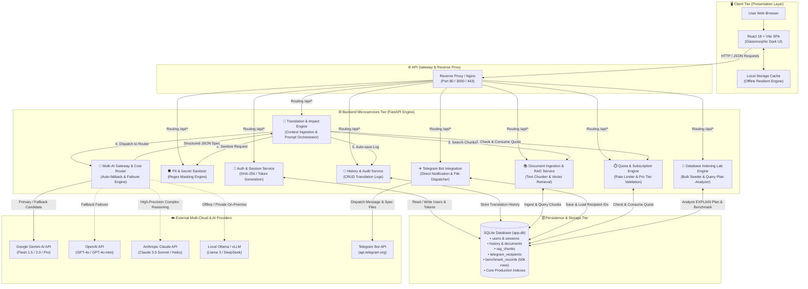

# 🌐 IT-to-Human Translator (ล่ามแปลภาษาไอทีอัจฉริยะ)

> **Enterprise AI-Powered Requirement Engineering & Technical Communication Platform**  
> โครงงานพัฒนาเว็บแอปพลิเคชัน Full-Stack ที่ทลายกำแพงการสื่อสารระหว่าง **"ฝ่ายธุรกิจ/ลูกค้า (Non-Tech)"** และ **"ทีมพัฒนา/โปรแกรมเมอร์ (Tech)"** ขับเคลื่อนด้วย **FastAPI**, **React + Vite**, **SQLite Database**, **Telegram Bot Webhook**, **Database Indexing Optimization Studio**, **Multi-AI Provider Architecture (Gemini, OpenAI, Claude, Local LLM)** และ **Docker**

---

## 📊 การประเมินผลการดำเนินงานของโปรเจกต์ตามความจริง (Realistic Self-Evaluation Progress)

| ระยะการพัฒนา (Roadmap Phases) | รายละเอียดขอบเขตงาน | สถานะตามจริง | สัดส่วนงาน (%) | ดำเนินการเสร็จจริง |
| :--- | :--- | :---: | :---: | :---: |
| **Phase 1: MVP & Context Ingestion** | Project Context Selector, Multi-format Export (OpenAPI, Jira, PDF, Email), Man-Days Estimator | **เสร็จสมบูรณ์** | 20% | 20% / 20% |
| **Phase 2: Knowledge Base & Security** | SQLite Database, RAG Ingestion Engine, Impact Analysis, PII Sanitizer Guardrails, Full Auth System | **เสร็จสมบูรณ์** | 25% | 25% / 25% |
| **Phase 3: Direct Toolchain & Bot Integration** | Telegram Bot One-click Delivery (Direct Channel/Group Forwarding, Saved Recipient DB) | **เสร็จสมบูรณ์** | 15% | 15% / 15% |
| **Phase 4: Token Quota & Monetization** | โครงสร้าง Rate Limit, Cooldown Modal, Pro Upgrade UI (ยังค้างการนับรอบตัดสิทธิ์ใช้งานจริงอย่างเข้มงวด และระบบส่งแจ้งเตือน Telegram หลังคูลดาวน์) | 🟡 **กำลังปรับปรุง (60%)** | 10% | **6%** / 10% |
| **Phase 5: High-Performance Database & Lab** | Core Production Indexes, Benchmark Sandbox (50k rows), Interactive Indexing Lab & Student Guide | **เสร็จสมบูรณ์** | 15% | 15% / 15% |
| **Phase 6: Multi-AI Model Gateway & Router** | โครงสร้างสถาปัตยกรรม Decoupled AI และ Multi-candidate Fallback บน Gemini (ส่วน OpenAI, Claude, และ Ollama ยังอยู่ในขั้นตอนการเชื่อมต่อ Endpoint เพิ่มเติม) | 🟠 **วางโครงสร้างแล้ว (33%)** | 15% | **5%** / 15% |
| **รวมความคืบหน้าภาพรวมทั้งหมด** | **ประเมินผลงานจากสถานะการพัฒนาจริง 100%** | ⏳ **พัฒนาไปแล้ว** | **100%** | **81% / 100%** |

> 🎯 **สรุปสถานะตามความเป็นจริง (81% Completed):**
> * **ส่วนที่เสร็จสมบูรณ์ 100% (75% ของงาน):** Core Translation, Impact Analysis, RAG Knowledge Base, PII Sanitizer, Full Auth, Telegram Bot Integration และ Database Indexing Lab Studio
> * **ส่วนที่อยู่ระหว่างดำเนินการและปรับปรุง (25% ของงาน):**
>   1. **Token Quota Enforcement:** ปัจจุบันมี UI นับเวลาและระบบบันทึก แต่**ยังไม่ได้เปิดใช้นับจำนวนครั้งจำกัดจริงแบบเข้มงวด** และ**รอเชื่อมต่อระบบ Background Task ยิงแจ้งเตือนผ่าน Telegram** เมื่อถึงเวลาคูลดาวน์
>   2. **Multi-AI Provider Implementation:** ปัจจุบันเชื่อมต่อและมี Fallback Pool บนตระกูล **Google Gemini** แล้ว ส่วนการเชื่อมต่อ OpenAI API, Anthropic Claude และ Local LLM อยู่ในระดับโครงสร้างสถาปัตยกรรม (Architecture Ready) ที่ต้องเพิ่ม API Keys และ Client Driver จริงในขั้นตอนถัดไป

---

## 🏗️ Microservices Architecture

สถาปัตยกรรมของระบบถูกออกแบบตามหลักการ **Decoupled Microservices & Layered Architecture** แบ่งการทำงานออกเป็น Service อิสระที่สื่อสารผ่าน REST API ดังแผนภาพต่อไปนี้:


```mermaid
flowchart TB
    subgraph ClientLayer["🖥️ Client Tier (Presentation Layer)"]
        UserBrowser["User Web Browser"]
        SPA["React 18 + Vite SPA\n(Glassmorphic Dark UI)"]
        LocalStorage["Local Storage Cache\n(Offline Resilient Engine)"]
    end

    subgraph APIGateway["🌐 API Gateway & Reverse Proxy"]
        NginxGateway["Reverse Proxy / Nginx\n(Port 80 / 3000 / 443)"]
    end

    subgraph MicroservicesTier["⚙️ Backend Microservices Tier (FastAPI Engine)"]
        AuthService["🔐 Auth & Session Service\n(SHA-256 / Token Generation)"]
        SanitizerService["🛡️ PII & Secret Sanitizer\n(Regex Masking Engine)"]
        RAGService["📚 Document Ingestion & RAG Service\n(Text Chunker & Vector Retrieval)"]
        TranslationService["🧠 Translation & Impact Engine\n(Context Ingestion & Prompt Orchestrator)"]
        HistoryService["📜 History & Audit Service\n(CRUD Translation Logs)"]
        TelegramService["✈️ Telegram Bot Integration\n(Direct Notification & File Dispatcher)"]
        QuotaService["⏱️ Quota & Subscription Engine\n(Rate Limiter & Pro Tier Validation)"]
        IndexingService["🧪 Database Indexing Lab Engine\n(Bulk Seeder & Query Plan Analyzer)"]
        AIRouter["🔀 Multi-AI Gateway & Cost Router\n(Auto-fallback & Failover Engine)"]
    end

    subgraph DataTier["🗄️ Persistence & Storage Tier"]
        SQLiteDB[("SQLite Database (app.db)\n• users & sessions\n• history & documents\n• rag_chunks\n• telegram_recipients\n• benchmark_records (50k rows)\n• Core Production Indexes")]
    end

    subgraph ExternalServices["☁️ External Multi-Cloud & AI Providers"]
        GeminiAI["Google Gemini AI API\n(Flash 1.5 / 2.0 / Pro)"]
        OpenAI["OpenAI API\n(GPT-4o / GPT-4o-mini)"]
        ClaudeAI["Anthropic Claude API\n(Claude 3.5 Sonnet / Haiku)"]
        LocalLLM["Local Ollama / vLLM\n(Llama 3 / DeepSeek)"]
        TelegramAPI["Telegram Bot API\n(api.telegram.org)"]
    end

    UserBrowser --> SPA
    SPA <--> LocalStorage
    SPA -->|HTTP / JSON Requests| NginxGateway
    NginxGateway -->|Routing /api/*| AuthService
    NginxGateway -->|Routing /api/*| SanitizerService
    NginxGateway -->|Routing /api/*| RAGService
    NginxGateway -->|Routing /api/*| TranslationService
    NginxGateway -->|Routing /api/*| HistoryService
    NginxGateway -->|Routing /api/*| TelegramService
    NginxGateway -->|Routing /api/*| QuotaService
    NginxGateway -->|Routing /api/*| IndexingService

    AuthService <-->|Read / Write Users & Tokens| SQLiteDB
    HistoryService <-->|Store Translation History| SQLiteDB
    RAGService <-->|Ingest & Query Chunks| SQLiteDB
    TelegramService <-->|Save & Load Recipient IDs| SQLiteDB
    QuotaService <-->|Check & Consume Quota| SQLiteDB
    IndexingService <-->|Analyze EXPLAIN Plan & Benchmark| SQLiteDB

    TranslationService -->|1. Check & Consume Quota| QuotaService
    TranslationService -->|2. Sanitize Request| SanitizerService
    TranslationService -->|3. Search Chunks| RAGService
    TranslationService -->|4. Dispatch to Router| AIRouter
    AIRouter -->|Primary / Fallback Candidate| GeminiAI
    AIRouter -.->|Fallback Failover| OpenAI
    AIRouter -.->|High-Precision Complex Reasoning| ClaudeAI
    AIRouter -.->|Offline / Private On-Premise| LocalLLM
    AIRouter -->|Structured JSON Spec| TranslationService
    TranslationService -->|5. Auto-save Log| HistoryService
    TelegramService -->|Dispatch Message & Spec Files| TelegramAPI
```

---

## 💻 Technology Stack Diagram


```mermaid
flowchart LR
    subgraph Frontend["🎨 Front-End Technology Stack"]
        F1["React 18"]
        F2["Vite 5 (Build Tool)"]
        F3["Vanilla Modern CSS\n(Glassmorphism / Tokens)"]
        F4["Lucide React (Icons)"]
        F5["HTML5 & ES6+ Modules"]
    end

    subgraph Backend["⚡ Back-End Technology Stack"]
        B1["Python 3.11+"]
        B2["FastAPI (Async Framework)"]
        B3["Pydantic v2 (Validation)"]
        B4["Uvicorn (ASGI Server)"]
        B5["HTTPX (Async HTTP Client)"]
    end

    subgraph Database["🗄️ Database & Storage Stack"]
        D1["SQLite 3 (Persistent Engine)"]
        D2["SQL Schema & Core B-Tree Indexes"]
        D3["Indexing Lab Sandbox (50k rows)"]
        D4["Browser LocalStorage (Fallback)"]
    end

    subgraph AIProviders["🤖 Multi-AI Gateway Providers"]
        A1["Google Gemini (Flash 1.5, 2.0, Pro)"]
        A2["OpenAI API (GPT-4o, GPT-4o-mini)"]
        A3["Anthropic Claude (3.5 Sonnet)"]
        A4["Local Private LLM (Ollama / vLLM)"]
    end

    subgraph DevOps["🚀 DevOps & Deployment"]
        O1["Docker & Multi-stage Build"]
        O2["Docker Compose"]
        O3["Git Version Control"]
        O4["Telegram Bot API"]
    end

    Frontend --> Backend
    Backend --> Database
    Backend --> AIProviders
    DevOps -.->|Deploys & Orchestrates| Frontend
    DevOps -.->|Deploys & Orchestrates| Backend
```

---

## ✨ ฟีเจอร์เด่นของระบบ (Key Features Implemented)

### 1. โหมด [Human-to-Tech] : แปลความต้องการลูกค้า ➔ ข้อกำหนดทางเทคนิค
* **Context-Aware Ingestion:** ใส่บริบท Tech Stack เดิมขององค์กร, ระดับงบประมาณ (Budget Level) และกรอบเวลา (Timeline Constraint)
* **Technical Requirements:** วิเคราะห์สเปกละเอียดครอบคลุม Frontend, Backend, Database, Security
* **Legacy Module Impact Analysis:** ระบุโมดูลเดิม (`Affected Modules`) และตารางฐานข้อมูล (`Affected Tables`) ที่ได้รับผลกระทบ พร้อมประเมินระยะเวลา Refactoring
* **Acceptance Criteria & NFRs:** สร้างเงื่อนไขตรวจรับงาน (Given-When-Then) และมาตรการความปลอดภัย PDPA/OWASP
* **Multi-Format Export:** ส่งออกเป็น **OpenAPI 3.0 Spec JSON**, **Jira Format**, **Markdown**, **PDF** และ **Client Email Draft**

### 2. โหมด [Tech-to-Human] : แปลศัพท์เทคนิค ➔ ภาษาธุรกิจที่สุภาพ
* **Everyday Analogy:** ใช้อุปมาอุปไมยเปรียบเทียบกับชีวิตประจำวันเพื่อความเข้าใจง่าย
* **Client Email Generator:** แปลงสถานะทางเทคนิคเป็นร่างอีเมลทางการส่งให้ลูกค้าได้ทันที

### 3. 🤖 Multi-AI Model Gateway & Smart Fallback Router
* **Multi-Provider Support:** โครงสร้าง API ออกแบบให้รองรับ AI หลากหลายผู้ให้บริการ (Google Gemini, OpenAI GPT, Anthropic Claude, และ On-Premise Local LLMs ผ่าน Ollama/vLLM)
* **Automatic Model Fallback (Failover Engine):** มีระบบจัดการ Candidate Models หากค่ายใดค่ายหนึ่งเกิดข้อผิดพลาด (เช่น Rate Limit 429, Token Exhausted, หรือ Server Timeout) ระบบจะสลับไปเรียกโมเดลสำรองใน Candidate Pool โดยอัตโนมัติ ทำให้เว็บไม่หยุดทำงาน
* **Decoupled AI Driver:** สถาปัตยกรรมแยกส่วนตรรกะการเรียก AI (AI Connector) ออกจาก Business Logic อย่างสิ้นเชิง รองรับการเพิ่ม API AI ใหม่ๆ เข้าสู่ระบบได้ง่ายเพียงเพิ่ม Driver Endpoint
* **Cost & Privacy Optimizer:** สามารถเลือกใช้งานโหมด **Private Local AI** เมื่อทำงานกับข้อมูลที่มีความลับสูงเพื่อป้องกันข้อมูลรั่วไหลออกนอกองค์กร

### 4. Telegram Bot One-Click Delivery Integration
* **Direct Dispatch:** ส่งโครงสร้างผลลัพธ์การแปลเข้า Telegram Channel / Group / Direct Chat ได้ในคลิกเดียว
* **Built-in System Bot Token:** มี Bot Token ระบบพร้อมใช้งาน ไม่ต้องให้ผู้ใช้ตั้งค่าเอง
* **Database Recipient Memory:** บันทึก Chat ID ที่เคยส่งลง SQLite ให้อัตโนมัติ เพื่อความสะดวกในการใช้งานรอบถัดไป
* **Dual Deliverables:** ส่งทั้งข้อความสรุป Markdown และแนบไฟล์โครงสร้าง JSON/Markdown

### 5. Token Quota & Subscription Management
* **Rate Limiting Guard & Cooldown:** มีกลไกหน้าต่างเวลาและ Cooldown Alert Modal คำนวณเวลานับถอยหลัง (เช่น "ใช้ได้อีกทีใน 3 ชม. 45 นาที") พร้อมปุ่ม Pro Tier Upgrade ผ่านแบบฟอร์ม PromptPay จำลอง
* **🔍 ข้อสังเกตและสถานะการทำงานปัจจุบัน (Known Status & Limitations):**
  * **การนับ Token รายครั้ง (Execution Counter):** ปัจจุบันการจำกัดยังเน้นตรวจจับรอบและคูลดาวน์เวลา แต่**ยังไม่ได้เปิดใช้นับจำนวนครั้งจำกัดจริงแบบเข้มงวด (Request Usage Count / Token Strict Limit)** ผู้ใช้จึงยังสามารถกดแปลต่อได้หากระบบยังไม่ได้ตัดรอบเด็ดขาด
  * **Telegram Cooldown Notification (Roadmap & Feature Planned):** ในกรณีที่โควตาหรือ Token หมด หากผู้ใช้ได้เชื่อมต่อและบันทึก **Telegram Chat ID** ไว้ในระบบ จะมีฟังก์ชันตั้งเวลา (Scheduled Background Task) ส่งข้อความแจ้งเตือนอัตโนมัติเข้า Telegram ทันทีว่า **"🎉 เว็บไซต์พร้อมให้คุณใช้งานได้ตามรอบเวลาที่กำหนดแล้ว!"** เพื่อให้ผู้ใช้กลับเข้ามาใช้งานได้โดยไม่ต้องคอยเฝ้าหน้าเว็บ

### 6. 🧪 Database Indexing Lab & Performance Optimization Studio
* **Core Production Indexes:** เพิ่ม B-Tree Index บนตาราง `history`, `rag_chunks`, `users`, `telegram_recipients` เพื่อให้ Query รวดเร็ว
* **Big Data Sandbox (50,000 แถว):** ปั๊มข้อมูลจำลองธุรกรรมขนาดใหญ่ด้วย High-Speed Bulk Seeding (PRAGMA optimized)
* **Interactive Plan Analysis:** คำสั่ง `EXPLAIN QUERY PLAN` แสดงการทำงานระหว่าง **Full Table Scan ($O(N)$)** เทียบกับ **Index Seek ($O(\log N)$)**
* **5 Experiment Presets:**
  1. *Exact Match Query* (`customer_id = 42`)
  2. *Date Range Query* (`transaction_date BETWEEN ...`)
  3. *Function Wrap Pitfall* (`substr(transaction_date, 1, 7) = ...` สูญเสีย Index)
  4. *Wildcard LIKE Pitfall* (`LIKE '%0042'` vs Prefix Search)
  5. *Composite Index* (`status + transaction_date`)
* **Student Guide:** คู่มือเรียนรู้ฉบับสมบูรณ์สำหรับนิสิตนำไปประยุกต์ใช้กับโปรเจกต์ของตนเอง (`indexing-lab-guide/STUDENT_LAB_GUIDE.md`)

---

## 🚀 การติดตั้งและรันโปรเจกต์ (Getting Started)

### 🔹 วิธีที่ 1: ดับเบิลคลิกเดียวผ่านไฟล์ Batch Script (บน Windows)
ดับเบิลคลิกไฟล์ **`start_server.bat`** เพื่อเปิดทั้ง FastAPI Backend (Port 8000) และ Vite Frontend (Port 3000) พร้อมกันในคลิกเดียว

---

### 🔹 วิธีที่ 2: รันด้วย Docker Compose
```bash
# 1. Clone repository
git clone https://github.com/67160328/ITHumanAssistance.git
cd ITHumanAssistance

# 2. สั่งรัน Containers
docker compose up -d --build
```
* **Frontend Web:** [http://localhost:3000](http://localhost:3000)
* **Backend API Docs (Swagger):** [http://localhost:8000/docs](http://localhost:8000/docs)

---

### 🔹 วิธีที่ 3: รันแยก Service สำหรับการพัฒนา (Manual Development)

#### 1. Backend Service (FastAPI)
```bash
pip install -r backend/requirements.txt
python -m uvicorn backend.main:app --host 127.0.0.1 --port 8000 --reload
```

#### 2. Frontend Service (React + Vite)
```bash
npm install
npm run dev
```

---

## 📂 โครงสร้างโฟลเดอร์โปรเจกต์ (Project Structure)
```text
ITHumanAssistance/
├── backend/
│   ├── app.db                 # SQLite Database เก็บข้อมูลถาวร
│   ├── database.py            # SQLite Connection, Schema, Production Indexes
│   ├── Dockerfile             # Dockerfile สำหรับ FastAPI Microservice
│   ├── indexing_service.py    # Database Benchmark & Query Plan Analyzer Engine
│   ├── main.py                # REST API Endpoints, Quota, Telegram & Lab Routes
│   ├── models.py              # Pydantic Schemas สำหรับ Request/Response
│   ├── requirements.txt       # Python Dependencies
│   ├── services.py            # RAG Engine, PII Sanitizer & Multi-AI Integration
│   └── telegram_service.py    # Telegram Bot Direct Delivery Service
├── indexing-lab-guide/
│   └── STUDENT_LAB_GUIDE.md   # คู่มือปฏิบัติการ Database Indexing สำหรับนิสิต
├── src/
│   ├── components/
│   │   ├── AuthModal.jsx             # Dialog เข้าสู่ระบบ / สมัครสมาชิก
│   │   ├── AuthPage.jsx              # Form เข้าสู่ระบบพร้อม Password Strength Meter
│   │   ├── ChangePasswordModal.jsx   # Dialog เปลี่ยนรหัสผ่าน
│   │   ├── ImpactAnalysisCard.jsx    # Component แสดงผลกระทบสถาปัตยกรรมเดิม
│   │   ├── IndexingLabModal.jsx      # ห้องทดลองจำลองและวิเคราะห์ Database Indexing
│   │   ├── KnowledgeBaseModal.jsx    # Dialog จัดการคลังเอกสารองค์กร (RAG)
│   │   ├── QuotaBadge.jsx            # ป้ายแสดงสถานะโควตาและแจ้งเตือนคูลดาวน์
│   │   ├── SettingsModal.jsx         # Dialog ตั้งค่า AI API Keys และ Telegram Bot
│   │   ├── SubscriptionModal.jsx     # Dialog สมัครสมาชิก Pro Plan ปลดล็อกโควตา
│   │   ├── TelegramModal.jsx         # Dialog ส่งผลลัพธ์เข้า Telegram Chat / Channel
│   │   └── UserMenu.jsx              # Avatar และ Dropdown โปรไฟล์ผู้ใช้
│   ├── services/
│   │   ├── aiService.js              # Client Direct Multi-AI Caller & Candidates
│   │   ├── indexingLabService.js     # API Service สำหรับ Indexing Lab
│   │   ├── quotaService.js           # API Service จัดการ Quota & Subscription
│   │   ├── telegramService.js        # Telegram Bot Client Service
│   │   └── translator.js             # Main Translator Orchestrator
│   ├── App.jsx                       # หน้าจอหลักของ Web Application
│   ├── index.css                     # Modern Glassmorphic Dark UI Design System
│   └── main.jsx                      # React Entry Point
├── docker-compose.yml                # Multi-container Setup
├── Dockerfile.frontend               # Nginx Web Server Container
├── start_server.bat                  # One-click Dual Server Launcher
└── package.json                      # Node.js Dependencies & NPM Scripts
```

---

## 📄 License
This project is developed for educational purposes under the **Computer Science & Web Application Curriculum**. Open-source under the [MIT License](LICENSE).
