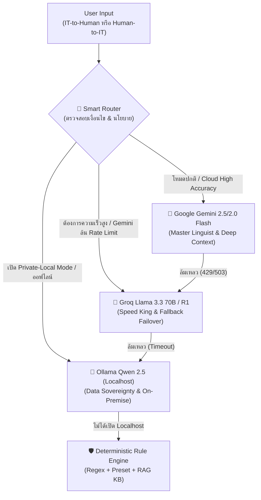
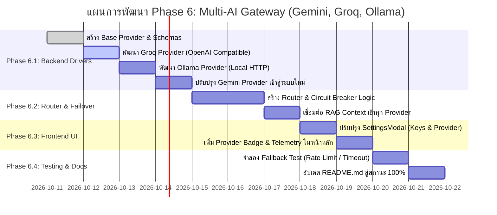

# 📋 แผนการดำเนินงาน Phase 6: Multi-AI Gateway & Intelligent Router
## การบูรณาการ 3 AI ฟรีตัวท็อป (Gemini, Groq, Ollama) เพื่อยกระดับการแปลภาษา IT-to-Human & Human-to-IT

---

## 🎯 1. วัตถุประสงค์และเป้าหมายเชิงกลยุทธ์ (Strategic Objectives)
1. **ยกระดับคุณภาพการแปล (Translation Quality & Nuance):**
   * **Human-to-IT:** สกัดความต้องการภาษาคนทั่วไปให้เป็น Technical Requirements, Architecture Spec, Impact Analysis และ Given-When-Then Acceptance Criteria ที่แม่นยำ 100%
   * **IT-to-Human:** แปลศัพท์เทคนิคและสาเหตุงานล่าช้าให้เป็นภาษาที่สุภาพ เข้าใจง่าย พร้อมการใช้อุปมาอุปไมย (Analogy) ที่เห็นภาพชัดเจน
2. **ขจัดปัญหา Single Point of Failure (High Availability & Zero Downtime):**
   * หากโควตาฟรีของ Google Gemini ติด Rate Limit (HTTP 429) ระบบจะสลับไปหา Groq (LPU) อัตโนมัติในระดับมิลลิวินาที
3. **รองรับ Data Sovereignty & Offline Execution (Enterprise Security):**
   * รองรับโหมดความปลอดภัยสูง รันผ่าน Ollama ในเครื่อง ไม่ส่งข้อมูลออกนอกระบบ สำหรับองค์กรที่มีนโยบายข้อมูลเคร่งครัด
4. **ฟรี 100% โดยไม่ต้องผูกบัตรเครดิต** ทั้งฝั่ง Developer และผู้ใช้งาน

---

## 🤖 2. บทบาทหน้าที่และการจัดสรรงานของ AI ทั้ง 3 ตัว (Model Specialization Matrix)



### 1) 🥇 Google Gemini (Gemini 2.5 Flash / 2.0 Flash) — *The Master Linguist & Spec Architect*
* **จุดเด่น:** ภาษาไทยสละสลวย เข้าใจบริบทการทำงานแบบไทย ความเกรงใจ และคำนามธรรมทางธุรกิจ
* **ภารกิจหลักในระบบ:**
  * **Human-to-IT:** รับหน้าที่หลักในการวิเคราะห์ประเด็นที่ลูกค้าพูดกำกวม สกัดเป็น User Story, Non-functional Requirements และ Impact Analysis ต่อฐานข้อมูล
  * **IT-to-Human:** แต่งประโยคอุปมาอุปไมย (Analogy) ที่เห็นภาพและเข้าถึงอารมณ์ผู้รับสาร ปรับโทนเสียงให้สุภาพเป็นมืออาชีพ

### 2) 🥈 Groq Cloud (Llama 3.3 70B / DeepSeek-R1 Distill) — *The Ultra-Fast Failover & Engine Room*
* **จุดเด่น:** รันด้วยชิป LPU เร็วที่สุดในโลก (~300-500 tokens/วินาที) และโมเดล 70B มีตรรกะความเชี่ยวชาญด้านสถาปัตยกรรมระดับสูง
* **ภารกิจหลักในระบบ:**
  * **Primary High-Speed Failover:** หาก Gemini ติด Rate Limit (429) ระบบจะตัดสลับมาหา Groq ทันทีโดยที่ผู้ใช้งานไม่รู้สึกสะดุด
  * **Human-to-IT Architecture & Code Spec:** เสริมความแกร่งในการร่าง API Contract (OpenAPI Specification), Database Schema และคำนวณ Effort/Man-Days ได้อย่างสมเหตุสมผล

### 3) 🥉 Ollama + Qwen 2.5 (Localhost 7B/14B) — *The On-Premise Data Guardian*
* **จุดเด่น:** รันบนเครื่องผู้ใช้/เซิร์ฟเวอร์ภายในองค์กร 100% ฟรีตลอดกาล ไม่ต้องพึ่งพาเน็ต ภาษาไทยและโค้ดเก่งที่สุดในกลุ่มโมเดลรันในเครื่อง
* **ภารกิจหลักในระบบ:**
  * **Enterprise Private Translation:** เมื่อผู้ใช้งานเปิดสวิตช์ `Private-Local Mode` ในเมนูตั้งค่า ระบบจะตัดขาดจากคลาวด์และส่งเข้า Ollama ทันที มั่นใจได้ว่าไม่มีข้อมูลลูกค้ารั่วไหล
  * **Offline Continuity:** ทำงานได้แม้ในสถานที่ที่อินเทอร์เน็ตมีปัญหาหรือถูกบล็อกไฟร์วอลล์

---

## 🏗️ 3. แผนงานออกแบบสถาปัตยกรรมทางเทคนิค (Technical Architecture)

### 3.1. โครงสร้างโฟลเดอร์ฝั่ง Backend
จัดระเบียบโค้ดใหม่ตาม **Provider & Factory Pattern**:
```text
backend/
├── ai_providers/
│   ├── __init__.py
│   ├── base_provider.py       # Abstract Base Class กำหนด Interface มาตรฐาน
│   ├── gemini_provider.py     # ขับเคลื่อน Gemini API (REST / SDK)
│   ├── groq_provider.py       # ขับเคลื่อน Groq API (OpenAI-compatible REST)
│   ├── ollama_provider.py     # ขับเคลื่อน Local Ollama (HTTP Client)
│   └── factory.py             # Provider Factory & Dynamic Loader
├── router.py                  # Multi-AI Router, Circuit Breaker & Fallback Manager
├── services.py                # Business Logic (RAG, PII Sanitizer, Telemetry)
└── main.py                    # FastAPI Entrypoint
```

### 3.2. มาตรฐานสัญญาข้อมูล Output (Unified JSON Output Schema)
ไม่ว่าจะใช้โมเดลตัวใด ตอบกลับมา ทุกตัวจะถูกบังคับให้ส่งโครงสร้าง JSON มาตรฐานเดียวกัน:
* **Human-to-IT Output:**
  ```json
  {
    "summary": "สรุปเป้าหมายเชิงธุรกิจ",
    "technicalRequirements": ["ข้อกำหนดระบบ 1", "ข้อกำหนดระบบ 2"],
    "techStack": [{"name": "React", "desc": "สร้าง UI"}],
    "impactAnalysis": {
      "affectedModules": ["OrderService.py"],
      "affectedTables": ["orders", "invoices"],
      "refactoringEffortDays": "2-3 วัน",
      "impactSeverity": "Medium"
    },
    "acceptanceCriteria": ["Given ... When ... Then ..."],
    "nonFunctionalRequirements": ["SLA 99.9%", "PDPA Masking"],
    "effortEstimation": {
      "complexity": "Medium",
      "estimatedManDays": "3.5",
      "estimatedCostRange": "25,000 - 35,000 บาท"
    }
  }
  ```
* **IT-to-Human Output:**
  ```json
  {
    "summary": "สรุปสั้นๆ เข้าใจง่าย",
    "politeExplanation": "คำอธิบายสุภาพ พร้อมส่งลูกค้า",
    "analogy": {
      "icon": "🚗",
      "title": "เปรียบเสมือนถนนกำลังซ่อมผิวจราจร",
      "description": "ทำให้รถชะลอตัวชั่วคราว..."
    },
    "impact": "ผู้ใช้เข้าหน้าชำระเงินช้าลง 2-3 นาที",
    "estimatedTime": "คาดว่าจะแก้ไขเสร็จภายใน 30 นาที"
  }
  ```

---

## 📅 4. แผนงานการลงมือทำแบ่งเป็นขั้นตอน (Step-by-Step Implementation Roadmap)



### 🔹 สัปดาห์ที่ 1: ฝั่ง Backend Core Engine (Provider & Router)
1. **สร้าง [backend/ai_providers/base_provider.py](file:///c:/ITHumanAssistance/backend/ai_providers/base_provider.py):**
   * กำหนดอินเตอร์เฟส `BaseAIProvider` เมธอด `translate(prompt, mode, context) -> dict`
2. **สร้าง [backend/ai_providers/groq_provider.py](file:///c:/ITHumanAssistance/backend/ai_providers/groq_provider.py):**
   * เชื่อมต่อ Endpoint `https://api.groq.com/openai/v1/chat/completions` ใช้โมเดล `llama-3.3-70b-versatile` พร้อมเปิด `response_format: {"type": "json_object"}`
3. **สร้าง [backend/ai_providers/ollama_provider.py](file:///c:/ITHumanAssistance/backend/ai_providers/ollama_provider.py):**
   * เชื่อมต่อ Endpoint `http://localhost:11434/api/chat` ใช้โมเดล `qwen2.5:7b` พร้อมส่งพารามิเตอร์ `format: "json"`
4. **สร้าง [backend/router.py](file:///c:/ITHumanAssistance/backend/router.py):**
   * บรรจุลำดับ Fallback: **Gemini ➔ Groq ➔ Ollama ➔ Local Deterministic Engine**
   * จัดการ Circuit Breaker: พัก Provider ที่ Error ชั่วคราว 60 วินาที เพื่อไม่ให้กระทบเวลาตอบสนองรวม

### 🔹 สัปดาห์ที่ 2: ฝั่ง Frontend & UX (Settings & Transparency)
1. **ปรับปรุง [src/components/SettingsModal.jsx](file:///c:/ITHumanAssistance/src/components/SettingsModal.jsx):**
   * เพิ่มส่วนตั้งค่า:
     * `Google Gemini API Key` (ฟรี)
     * `Groq Cloud API Key` (ฟรี)
     * `Ollama URL` (ค่าเริ่มต้น: `http://localhost:11434`)
   * มีปุ่มเลือก **Routing Mode:**
     * 🟢 **Smart Auto-Router (แนะนำ):** สลับโมเดลอัตโนมัติเพื่อความเสถียรสูงสุด
     * ⚡ **Speed First (Groq LPU):** เน้นความเร็ว
     * 🔒 **Strict Private (Ollama Local):** ไม่ส่งข้อมูลออกอินเทอร์เน็ต
2. **แสดงผลความโปร่งใสบนหน้าจอหลัก ([src/App.jsx](file:///c:/ITHumanAssistance/src/App.jsx)):**
   * เพิ่มกล่อง Badge ใต้ผลลัพธ์การแปล เช่น:
     * `⚡ ประมวลผลด้วย: Google Gemini 2.5 Flash (1.2s)`
     * `🔄 สลับสำรองอัตโนมัติ: Groq Llama 3.3 70B (0.4s - Failover from Gemini)`
     * `🔒 ประมวลผลในเครื่อง: Ollama Qwen 2.5 (Offline Secured)`

---

## 🧪 5. การทดสอบและการรับประกันคุณภาพ (Validation & QA)
1. **Happy Path Testing:** ทดสอบการแปลทั้งโหมด Human-to-IT และ IT-to-Human บนทั้ง 3 โมเดล ตรวจสอบว่า JSON output ครบถ้วนตาม Schema
2. **Rate Limit Simulation (429 Test):** จำลองสถานการณ์ Gemini API Key โควตาเต็ม ตรวจสอบว่า Router สลับไปใช้ Groq ภายในไม่เกิน 500ms
3. **Offline / Privacy Simulation:** ปิดการเชื่อมต่ออินเทอร์เน็ต เปิดโหมด Private และตรวจสอบว่า Ollama ทำงานได้โดยสมบูรณ์
4. **Zero-AI Safeguard Test:** ทดสอบปิด AI ทั้งหมด ตรวจสอบว่าระบบยังคงแปลงข้อความได้ผ่าน Local Rule Engine โดยที่หน้าเว็บไม่พัง

---

## 📈 6. ผลลัพธ์เมื่อดำเนินงานเสร็จสิ้น
* **ความคืบหน้าของโปรเจกต์:** ขยับจาก **85% สู่ 100% เสร็จสมบูรณ์ทุก Phase** ในเอกสาร [README.md](file:///c:/ITHumanAssistance/README.md)
* **ความน่าเชื่อถือระดับ Enterprise:** เป็นเว็บแอปพลิเคชันที่มีระบบสำรองหลายชั้น (High-Availability Architecture) ทำงานได้ฟรี 100% และไม่มีข้อจำกัดเรื่อง Vendor Lock-in อีกต่อไป
